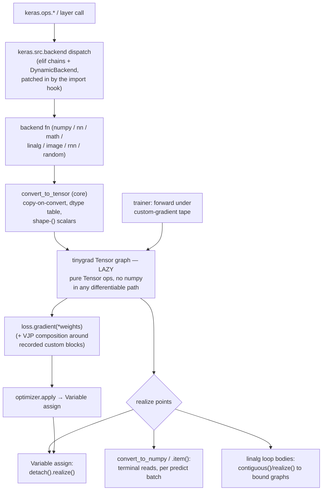

# Architecture — the tinygrad backend itself

This file describes module boundaries, state ownership, and data-flow direction
in the backend sources (`_backend/`, mirrored from the reference keras clone's
`keras/src/backend/tinygrad/`). It stays at module altitude: no function
signatures, no line numbers, only contracts and invariants that survive
refactors. The import-hook mechanism that grafts these modules onto stock
Keras is covered by `docs/how-it-works.md`, not here.

**Maintenance rule:** update this file in the same diff whenever a *boundary*
moves (a module changes owner, a monkeypatch is added or removed, a keras-core
touchpoint appears, an invariant below stops being true). Internal refactors
that keep the boundaries intact don't need an edit here. If a statement in
this file is wrong, that's a bug in the diff that made it wrong.

## The big picture

Everything between `convert_to_tensor` and a realize point is a lazy tinygrad
graph. The backend's job is to keep that stretch pure (differentiable, no
numpy round-trips) and to make every exit from it explicit.

## Module map

- **core** — the trunk: `Variable`, `convert_to_tensor`/`convert_to_numpy`,
  the bidirectional Keras↔tinygrad dtype tables, `DType.__str__` (Keras
  spellings; `__repr__` stays tinygrad's), scan/loop/cond/scatter/slice
  primitives, `compute_output_spec`, the custom-gradient tape +
  `compute_gradients` (hand-composed VJPs over `Tensor.gradient`), and the
  complex-lite `ComplexTensor` wrapper (a `.real`/`.imag` float32-Tensor
  pair whose `.dtype` is the plain string `"complex64"`; stateless values,
  no new owned state).
- **numpy** — the `keras.ops.numpy` surface: direct Tensor-method ports,
  Keras dtype promotion via `result_type` (python scalars stay weak-typed),
  the PEP 562 module `__getattr__` that turns every missing op into a loud
  `NotImplementedError`, and the Tensor scalar-interop monkeypatches
  (`__bool__`, `__array__`, `__float__`, `__int__`, `__index__`).
- **nn** — `keras.ops.nn`; semantics copied from the numpy backend
  (epsilon-clipping, normalization details), executed as tinygrad ops.
- **math** — minimal `keras.ops.math`; the fft family is matmul-DFT against
  cached host-built constant matrices (fine for STFT-scale n), erfinv is a
  float32 polynomial. numpy appears only for creation-time constant tables.
- **linalg** — shape-stable classic algorithms (Householder QR, Gauss-Jordan
  inverse/solve with partial pivoting, cyclic Jacobi for eig/svd), computed
  internally in float64 and cast back; `.item()` only on error/control paths.
- **image** — gather-based sampling and weight-matrix matmuls so gradients
  flow w.r.t. the image; numpy only for static coordinate/weight tables;
  coordinate-side inputs get no gradients (numpy-reference behavior).
- **rnn** — the generic `rnn()` scan, a straight port of the numpy backend's,
  run on Tensors end-to-end so gradients flow through the time loop;
  `cudnn_ok` answers False and the fused lstm/gru stubs raise.
- **random** — numpy `Generator` sampling seeded through Keras'
  `SeedGenerator`, samples wrapped as Tensors. This is a feature, not a
  shortcut: seeding semantics and drawn bits are identical to the reference
  numpy backend, so cross-backend tests compare like for like. Samples are
  autograd constants; gradients flow through the arithmetic they enter
  (dropout's multiply), never through sampling. `shuffle` draws a
  permutation *index table* host-side (bit-identical to the reference's
  `rng.permuted`) and applies it via a differentiable gather, so data
  tensors never round-trip through numpy.
- **trainer** — numpy-backend data plumbing (plain `EpochIterator`, numpy
  batches converted per step) + torch-backend gradient shape, expressed as
  tinygrad's explicit `loss.gradient(*tensors)`; no zero_grad bookkeeping,
  gradients are pure outputs applied by Keras' backend-agnostic
  `optimizer.apply`. Forward runs under the custom-gradient tape so
  quantized layers' backward functions are honored; with no blocks the step
  is exactly `loss.gradient`. `predict` converts to numpy per batch.
- **layer / export** — shims: an empty mixin, and an `ExportArchive` whose
  methods raise (the class must merely import).

## State ownership map

| State | Owner | Notes |
|---|---|---|
| Variable metadata (name, dtype, trainable, shape) | `KerasVariable` base (keras-core) | backend never duplicates it |
| Variable value | `core.Variable._value` — a **realized, detached** tinygrad Tensor | re-realized on every assign; `requires_grad` mirrors `trainable` |
| Live activations / loss | anonymous lazy Tensor graphs | owned by nobody; must reach a realize point before source buffers are recycled |
| Keras↔tinygrad dtype tables | `core` module constants | the single mapping; `standardize_dtype` shim routes through it |
| Monkeypatched class attributes (`Tensor.__bool__`, `__array__`, `__float__`, `__int__`, `__index__`; `DType.__str__`) | installed at import time by `numpy` (scalar interop) and `core` (dtype str) | process-global; closed set (invariant 6) |
| Custom-gradient tape | `core` thread-local; a tape is opened per train step by the trainer | outside a tape, `custom_gradient` blocks are forward passthrough |
| RNG state | host path: none — a fresh numpy `Generator` per call from the drawn seed. Device path (inside `device_rng_scope`): tinygrad's per-device threefry `(seed, counter)` tensors, re-seeded per train-function build from the first device draw's SeedGenerator, which that seeding advances (`random._ensure_device_stream_seeded` / `reset_device_stream`) | statefulness otherwise lives in Keras' `SeedGenerator`, like every backend |
| DFT constant matrices | `math` module cache keyed by (kind, n, dtype) | host-built constants, not gradient paths |
| train/test/predict function slots | `TinygradTrainer` instance | test/predict are plain closures; train is a `_TrainStepJit`: per-batch-signature `TinyJit` captures (cap 8) + a variable→pinned-buffer binding so weight updates propagate into replays |

## The seams

### keras-core touchpoints — THE contract surface

Stock Keras has no backend plugin API; the backend exists inside keras-core
at exactly **six touchpoints** (this is what the packaging hook patches — see
how-it-works.md for *how*):

1. `keras.src.backend` — the backend-loader `elif` chain (star-import +
   `BackendVariable`).
2. `keras.src.models.model` — the per-backend `Trainer` dispatch.
3. `keras.src.layers.layer` — the per-backend `Layer` mixin dispatch.
4. `keras.src.export.saved_model` — the `ExportArchive` dispatch (imported
   unconditionally, so its `raise` is load-bearing).
5. `keras.src.backend.common.variables` — `standardize_dtype` (tinygrad
   `DType.name` spellings are not Keras dtype names; mapped through core's
   table).
6. `keras.src.utils.backend_utils` — `DynamicBackend`'s per-backend branch.

The six touchpoints have a second consumer besides the loader: the
plugin-backends PoC (docs/upstream/keras-plugin-poc.md) formalizes them as
an entry-point protocol (`keras.backends` group; standard names
`trainer.Trainer` / `layer.Layer` / `export.ExportArchive` /
`standardize_dtype_hook`, aliased in the backend sources). On a keras with
native plugin support the packaged hook detects `backend/plugins.py` and
stands down (`__init__.py`'s filesystem probe); on stock keras the entry
point is inert and the hook patches as described below.

**The rule:** these six ARE the contract between the backend and keras-core.
Any change that adds a keras-core touchpoint must add the matching anchor to
the package loader's patch table (`_loader.py`'s `_PATCHES`) in the same
change — a touchpoint that exists only in a hand-patched keras tree is
invisible to every user of the packaged hook. `scripts/sync_vendor.py
--self-check` guards anchor drift against installed stock Keras (the
unpatched state); the referee (`scripts/referee.sh`) runs Keras' tests
through the hook itself, so a missing anchor fails there too.

### The tensor boundary (core)

- `convert_to_tensor` is the single entry: dtype standardization + promotion,
  native stacking of Tensor-bearing sequences (a numpy round-trip would
  detach gradients), and **copy-on-convert** — tinygrad wraps numpy buffers
  zero-copy and reads them lazily at realize time, while Keras assumes value
  semantics at conversion (data adapters recycle batch buffers; without the
  copy, the first post-fit predict computes on clobbered memory).
- Scalars are shape `()`, never tinygrad's default `(1,)` wrap — metric
  variables are real scalars on every backend.
- `convert_to_numpy` is the terminal exit; float8 tensors are re-quantized
  through `ml_dtypes` so callers see the same array dtype as other backends.
- Variables **realize on assign** (detached concrete buffers), which bounds
  lazy-graph growth across training steps; the other deliberate realize
  points are per-batch predict conversion and the `contiguous()/realize()`
  calls inside linalg's iterative loops.

### The gradient seam (core ⇄ trainer)

tinygrad has no custom-VJP hook, but `Tensor.gradient` takes explicit seeds.
`custom_gradient` blocks detach their output (cutting autograd through the
block internals) and record `(args, proxy, grad_fn)` on the thread-local
tape; `compute_gradients` walks blocks in reverse creation order, composing
VJPs by hand with torch-backend calling conventions. The trainer is the only
tape opener; symbolic build / predict / evaluate see passthrough behavior.

## Invariants (the short list)

1. **The numpy backend is the semantic reference and Keras' own test suite is
   the referee.** Where behavior is unspecified, do what numpy-backend does;
   a deviation without a comment naming it is a bug.
2. **No silent numpy fallbacks in differentiable paths.** Missing ops raise
   `NotImplementedError` — loudly, via PEP 562 module `__getattr__` or an
   explicit raise. A fallback would silently detach gradients, and the
   op-coverage tally is only honest if missing means loud.
3. Host-side numpy appears only in three sanctioned roles: creation-time
   constant tables, terminal conversions, and RNG sampling. Never between a
   model input and a returned tensor.
4. **Copy-on-convert.** Every numpy buffer entering a Tensor is copied,
   because tinygrad wraps zero-copy and reads lazily.
5. **Variables realize on assign**; long tensor loops bound their lazy graphs
   explicitly. A lazy graph must never outlive the buffers it reads.
6. **Monkeypatches are a closed, minimal set** — `Tensor.__bool__`,
   `__array__`, `__float__`, `__int__`, `__index__` and `DType.__str__`
   (`__repr__` stays tinygrad's). All are scalar-interop shims that add
   missing behavior, with one named exception: `Tensor.__bool__`
   deliberately REPLACES tinygrad's always-raising implementation
   (single-element truthiness, numpy semantics). Nothing else may override
   an existing tinygrad attribute, and op implementations never depend on
   any of these patches.
7. Scalars are shape `()`, not `(1,)`.
8. int8 matmul accumulates in int32 (quantized inference corrupts otherwise).
9. Random ops are numpy-Generator sampling under Keras seeding —
   bit-reproducible against the reference backend — EXCEPT inside the
   trainer's `device_rng_scope`, where dropout/normal/uniform seeded by a
   SeedGenerator or by None (Keras' global generator) sample on-device
   (tinygrad threefry): those draws are deterministic under Keras seeding
   (the stream is seeded from the seed state at every train-function
   build; receipts in `tests/test_backend_regressions.py`) but
   NOT numpy-bit-parity — the scoped deviation whose decision record is
   `docs/device-rng.md`. Samples are autograd constants on both paths.
10. `custom_gradient` is honored only under the trainer's tape; elsewhere it
    is a forward passthrough by design.
11. Every keras-core touchpoint has an anchor in the loader's patch table —
    added in the same change that creates the touchpoint.

## Known leaks and quirks (accepted, not aspirational)

- **The train step is TinyJit-compiled; everything else stays eager.**
  One capture per batch signature (partial final batch = its own capture);
  weight propagation via pinned buffers (in-place `Tensor.assign`, the
  tinygrad-optimizer pattern). The safety story: tinygrad 0.13 raises
  `JitError` on any host data access during capture, so every freeze
  hazard (host RNG, `.item()`, `ops.cond` schedules) fails loudly at
  capture and the trainer falls back to eager with a warning. Static
  eager gates: custom `train_step`, seed-generator layers not on
  `_device_rng_covers`'s exact-type list (covered layers keep the JIT
  because their draws are on-device),
  LossScaleOptimizer, gradient accumulation, EMA, non-empty
  custom-gradient tape (quantized training), `run_eagerly`. Escape hatch
  `KERAS_TINYGRAD_TRAINER_JIT=0`. Eager-vs-jit verified bit-for-bit over
  12 scenarios; ~5–15x steady-state steps/sec. test/predict remain
  eager per-step compilation.
- Fused `lstm` / `gru` / bidirectional kernels are loud stubs; `cudnn_ok`
  answers False so recurrent layers always take the generic scan (correct,
  differentiable, slow).
- float8 interop is a recast dance: fp8 tensors are built as float32 buffers
  and cast on-device; `convert_to_numpy` re-quantizes through `ml_dtypes` to
  match other backends' array dtype.
- linalg computes internally in float64 regardless of input dtype; fine on
  CPU, a cost on accelerators.
- `scatter_update` applies updates one masked `where` at a time to preserve
  numpy's duplicate-index ordering — O(updates) graph depth.
- `scatter` is built as a one-hot matmul; the one-hot exists only
  symbolically — tinygrad fuses it into the reduce kernel, so memory stays
  flat (measured 2026-08-29: 0.4 GB peak at 1M slots × 50k updates, capped
  subprocess). The cost is compute, O(slots × updates) fused work: ~4 s at
  that extreme scale, negligible below it. Differentiable w.r.t. values.
- Quantized training pays twice: `compute_gradients` composes VJPs in
  O(blocks²) lazy-graph builds, and a non-empty custom-gradient tape gates
  the train-step JIT off — the slowest configuration on both axes at once.
- The zig-cc shim (README/CONTRIBUTING) is a box workaround for clang-less
  machines, not a product feature of the backend.
- Sparse and ragged tensors and string preprocessing layers are deliberately
  out of scope (`SUPPORTS_*` flags say so up front). Complex dtypes are
  **complex-lite interop only**: `view_as_complex`/`view_as_real` work via
  core's `ComplexTensor` wrapper with a closed op set (enter/leave through
  `convert_to_tensor`/`convert_to_numpy`/`cast`-to-complex64, `real`/`imag`,
  pairwise `+`, python-scalar `*`). Complex ARITHMETIC (tensor multiply,
  matmul, reductions, conjugate, ...) remains out of scope and raises a
  uniform loud `NotImplementedError`; `SUPPORTS_COMPLEX_DTYPES` stays False.
  The tier boundary (interop vs arithmetic) and the rule for extending the
  wrapper's op set: `docs/complex-support.md`.
- The backend sources live ONCE: `src/keras_tinygrad/_backend/`. (Until
  2026-08-30 they were a snapshot of a sibling keras clone; that clone is
  now a leftover and no tool reads it.) The referee clones the pinned
  keras tag on its own into `.referee/`.
