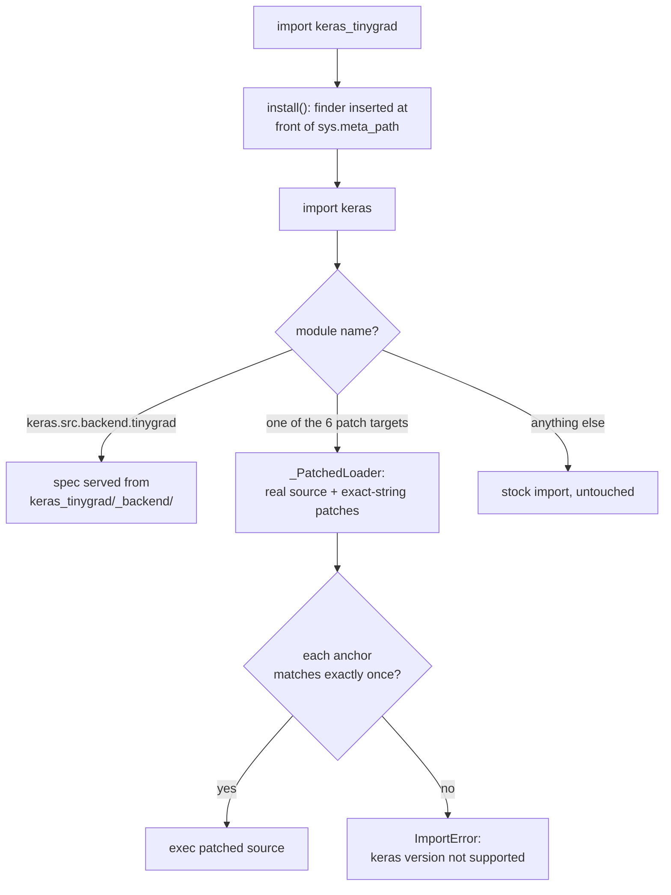

# How it works

Two halves: an **import hook** that grafts the backend onto stock Keras, and
the **backend** itself, a tinygrad implementation of the Keras backend
surface. Neither touches your Keras install on disk.

## The import hook

Keras 3 selects its backend with hardcoded `elif` chains that `raise` at
import time for unknown names. There is no plugin API. So `import
keras_tinygrad` inserts a `MetaPathFinder` at the front of `sys.meta_path`
— before Keras is imported — that does exactly two things:

1. **Serves** `keras.src.backend.tinygrad` from this package's `_backend/`
   directory. Only the package name itself is intercepted; once its
   `__path__` points at `_backend/`, the stock `PathFinder` resolves every
   submodule normally.
2. **Patches** six stock Keras modules by exec'ing a copy of their source
   with exact-string replacements: the backend loader's `elif` chain, the
   `standardize_dtype` shim (tinygrad `DType.name` spellings differ from
   Keras'), the per-backend `Layer` mixin, the per-backend `Trainer`,
   `DynamicBackend`'s per-backend branch (its `__getattr__` silently
   returns `None` for unknown backends, which would crash preprocessing
   layers downstream), and `ExportArchive` (imported unconditionally, so
   its `raise` must be patched too).

The anchor rule is the whole safety story: every replacement anchor must
occur **exactly once** in the real source. Zero or two matches means the
upstream source changed, and the import refuses to continue with a
version-mismatch error. We never guess, and we never let Keras fall through
to its own opaque `Unable to import backend` error. `install()` also
refuses to run if any patch target is already in `sys.modules` — a
half-patched Keras cannot exist.

Because the patched loader keeps the real package `__path__` and origin,
tracebacks point at the real files and every sibling module imports from
the stock install.

## The backend

`_backend/` mirrors the layout of Keras' in-tree backends: `core.py`
(tensors, variables, dtypes), `numpy.py` (the `keras.ops.numpy` surface),
`nn.py`, `math.py`, `rnn.py`, `random.py`, `image.py`, `linalg.py`,
`layer.py`, `trainer.py`, `export.py`.

**Semantic reference: the numpy backend.** Where Keras' numpy backend
defines the expected behavior, ours ports it to tinygrad tensors
end-to-end. The generic `rnn()` scan is a straight port of numpy's, so
gradients flow through the unrolled time loop; the fused lstm/gru kernels
are only a cudnn fast path, `cudnn_ok` answers `False`, and the fused
stubs stay loud.

**Training.** The trainer plumbs data like the numpy backend (plain
`EpochIterator`, numpy batches converted per step) and takes gradients like
the torch backend — expressed through tinygrad 0.13's explicit
`loss.gradient(*tensors)` API. No `zero_grad` bookkeeping: gradients are
pure outputs, applied by Keras' backend-agnostic
`optimizer.apply(grads, variables)`. Quantized layers (int8 / int4) record
`custom_gradient` blocks on a tape during the forward pass so
`compute_gradients` can honor their backward functions; with no such blocks
the step is exactly `loss.gradient`.

**Dtypes.** A single bidirectional table maps Keras dtype names to tinygrad
`DType`s (including bfloat16 and both float8s, which are built as float32
buffers and cast on-device). `DType.__str__` is given the Keras spelling so
`str(tensor.dtype)` matches every other backend; `__repr__` stays
tinygrad's own.

**No silent fallbacks.** Anything not yet ported raises
`NotImplementedError` via module-level `__getattr__` (PEP 562) or an
explicit raise. A numpy fallback would silently detach gradients — and the
op-coverage tally against Keras' own test suite is only honest if missing
means loud.

**Monkeypatches are additive and few.** Exactly the ones stock-Keras
interop forces — the closed set from `docs/architecture.md`:
`Tensor.__bool__` (numpy-style scalar truthiness on one-element tensors;
multi-element still raises), `Tensor.__array__` (numpy interop for
tuple-returning ops and the test harness), `Tensor.__float__` /
`__int__` / `__index__` (installed only if tinygrad lacks them, for python
scalar contexts), and the `DType.__str__` above. Op implementations
themselves never round-trip through numpy.

## Version support

The patch anchors are verified against specific Keras releases (currently
3.15.0 and 3.15.1; the dependency pin is `keras>=3.15,<3.16`). A new Keras
release either matches — and everything works —
or the import fails at the anchor check with a clear message. Fixing that
means updating the anchor table, never shipping a guess.
